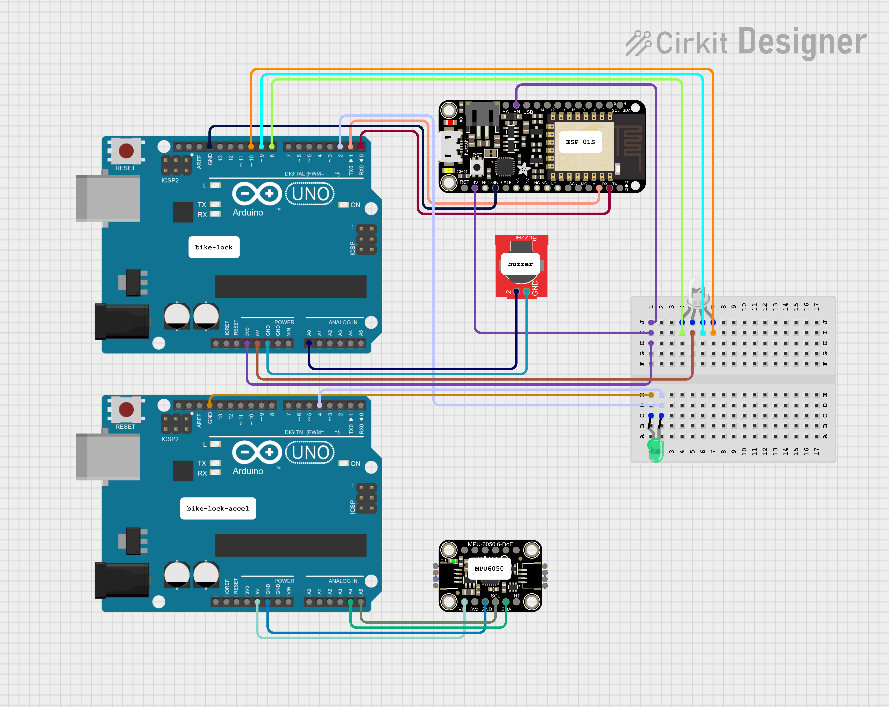

# BikeLock Arduino

This is the code for the Arduinos.

If you wish to try it for yourself, here's the electrical diagram this group
used:

You may notice we are using two Arduinos. This was due to a limitation with Arduino Serials, which disallowed the use of the accelerometer and WiFi modules on the same Uno board.

The two folders `bike-lock` and `bike-lock-accel` are the two project folders, one for each Arduino, as commented in the diagram.

# `bike-lock-accel`

This Arduino is responsible for motion-sensing, i.e. detecting theft based on movement. It does so by, every 100ms, sampling the acceleration, and by checking its derivative's (formally called 'jerk') norm. If it's larger than approximately $283\text{ m/s}^3$, we have detected movement, and send a signal to `bike-lock` for 1 second.

# `bike-lock`

This is the project responsible for everything else:

- WiFi
- State Management
- Alarm

Let's talk about each of them.

## WiFi

After trying to use the `SoftwareSerial.h` library to communicate with the ESP-01S, we concluded it to be too slow for the job, which resulted in a lot of noise in the responses we got from it.

That's why we use it as we show in the diagram: by connecting the ESP to Arduino's Hardware Serial. The only drawback is that we have no other Serials to use, and thus cannot communicate freely with the computer to send logs, and - the most annoying - we have to undo the connection to pins 0 and 1 for uploading any code to the board to work. This proved to be a very exausting way to iterate over our code, but it worked in the end.

We created a function `log` that, by using special formatting, allows us to log messages to the computer without breaking the ESP, with the only drawback that it clears the Serial every time it's ran, making it a bit of a challenge choosing when to log.

Overall, the WiFi flow is the following for sending an HTTP request:

1. Check connection status
    
    1. If we are disconnected from WiFi, reconnect
    
    1. If the TCP connection was closed, reopen it

    1. If the TCP connection is open, do nothing

1. Request send permission, specifying the number of bytes to be sent

1. If ok, then send the data

1. Wait for response

## State Management

We have 3 major states in the lock:

- Unlocked (default)
- Locked
- Alarm

### Unlocked

This means the bike is not locked. Whenever the board turns on, it defaults to this state. It is represented with a blue light.

Here, with an interval of 3s, it checks the state of the lock in the API. If it happens that the lock in the API in a different state, it updates itself.

If the API states that it's waiting for a lock confirmation (i.e. the app has requested to lock the lock, and is waiting for confirmation), then we send this confirmation and change to Locked state.

### Locked

The system will be in this state when the bike is virtually locked. It is represented with a green lock.

Again with an interval of 3s, we check the state of the lock in the API. It it happens to be in the wrong state, it is immediately fixed.

If the API states that it's waiting for a finish confirmation (i.e. the app has required the lock to be unlocked, and is waiting confirmation), then we send this confirmation and change to Unlocked state.

Here, we also use a pin interrupt to check for movement. The signal in this pin comes from the `bike-lock-accel` Arduino. If movement is detected, we change to the Alarm state.

### Alarm

This state indicates that the bike has been stolen. Here we have two objectives:

1. Play an alarm sound
2. Alert and update the API

Every ~10s we update the API with our battery level and location. When the network duties are done, we play the alarm, which lasts for about 10 seconds, and once it's finished we restart: update the API, replay the alarm, etc.

When updating the alarm, we also check if there is a request to unlock the bike (just like in the Locked state), and if so, we confirm it and change to state Unlocked.